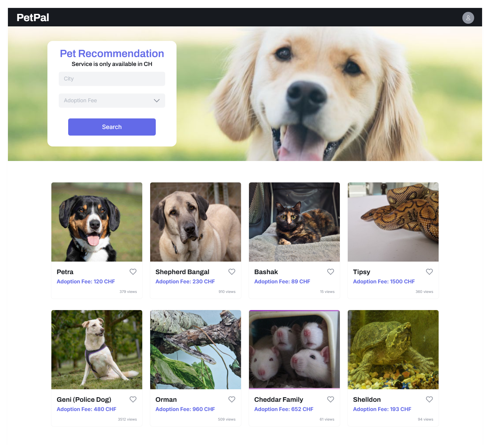
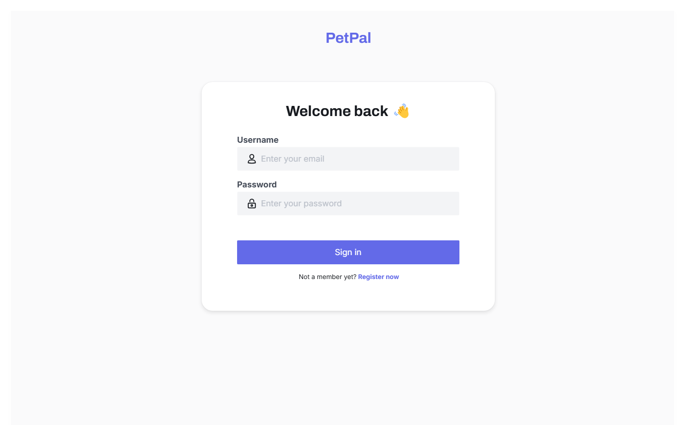

# PetPal

## Scenario Ideation
PetPal is an e-commerce platform facilitating pet adoption, where users can browse available pets, apply for adoption, and receive confirmation. Admins manage the pet inventory, review applications, and approve or reject adoption requests. The system also provides personalized pet recommendations based on user preferences such as size, activity level, lifestyle compatibility, location, and adoption fee range.

---

## Use Case Analysis

### Actors:
- **Admin**: Manages pets and adoption applications.
- **User**: Browses available pets, applies for adoption, and pays the adoption fee after confirmation.

### Preconditions:
- Pets are added to the system with relevant details (breed, size, age, medical status, etc.).
- Users must be logged in to view and adopt pets.

### Basic Flow:
#### User Actions:
1. **User Login**: The user logs into their account.
2. **Browse Pets**: The user views the list of available pets.
3. **Select Pet**: The user selects a pet to adopt, using filters such as location, size, activity level, and adoption fee range.
4. **Apply for Adoption**: The user fills out and submits the adoption form.
5. **Receive Confirmation**: The system confirms the adoption request and provides payment instructions.
6. **Pay Adoption Fee**: After the admin approves the adoption, the user pays the adoption fee on-site.

#### Admin Actions:
1. **Admin Login**: The admin logs into the system.
2. **Manage Pet Inventory**: The admin adds, edits, or removes pets.
3. **Review Applications**: The admin reviews adoption applications and either approves or rejects them.
4. **Approve Adoption**: If the application is approved, the admin marks the pet as "Adopted" and the adoption fee is triggered.

### Postconditions:
- Successfully adopted pets are marked as "Adopted."
- Admins manage the pet inventory and process adoption applications effectively.

### Business Rule:
**Pet Recommendations**: The system generates personalized recommendations based on user preferences like size, activity level, lifestyle compatibility, location, and adoption fee range.

---

## User Story Writing

### User Stories
#### User:
1. As a user, I want to browse a list of available pets based on my preferences (size, activity level, location, adoption fee range) so that I can find a pet that suits my lifestyle.
2. As a user, I want to view detailed information about the pet (e.g., breed, size, age, medical status) so that I can make an informed adoption decision.
3. As a user, I want to apply for pet adoption online so that I can conveniently adopt a pet.
4. As a user, I want to receive confirmation after submitting my adoption application, so that I know the next steps.
5. As a user, I want to pay the adoption fee online after my adoption is confirmed so that the adoption process can be completed.

#### Admin:
1. As an admin, I want to log into the system so that I can manage pet adoption processes.
2. As an admin, I want to add, edit, or remove pets from the inventory so that the system always has up-to-date pet listings.
3. As an admin, I want to review adoption applications so that I can ensure responsible pet adoptions.
4. As an admin, I want to approve or reject adoption applications so that I can facilitate appropriate matches between pets and users.

---

## Profile Management
### User Profile:
- After logging in, users can view and update their profile details, including:
  - **Personal Information**: Name, email, contact details.
  - **Adoption History**: A list of past adopted pets and their details.
  - **Current Applications**: Information about ongoing adoption applications.
  - **Payment Details**: View payment history related to adoption fees.

---

## Domain Model

## UI Designs
### Admin Dashboard Designs

### User View Design

### Authentication Design

---

